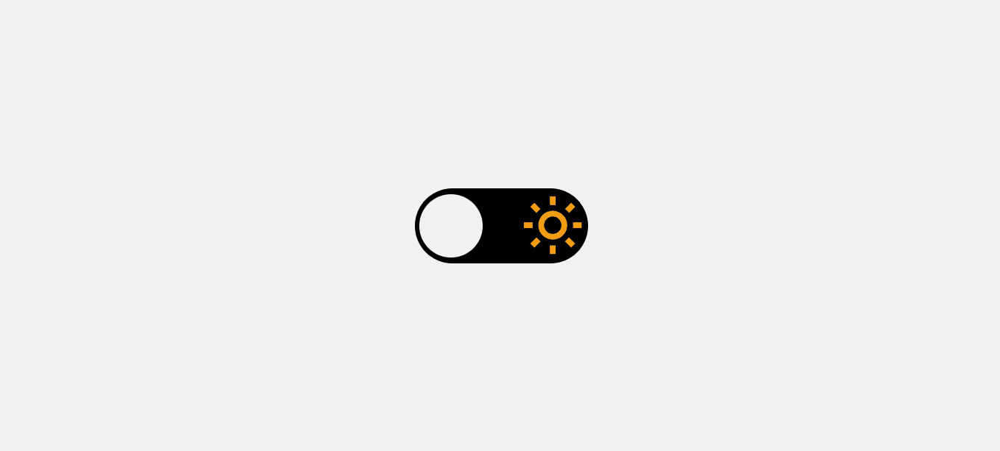

<h1 align="center">
     Theme Switcher 
</h1>
<h2>
</h2>

  <a href="#bookmark-sobre">Sobre</a>&nbsp;&nbsp;&nbsp;|&nbsp;&nbsp;&nbsp;
  <a href="#rocket-tecnologias">Tecnologias</a>&nbsp;&nbsp;&nbsp;|&nbsp;&nbsp;&nbsp;
  <a href="#design">Layout</a>&nbsp;&nbsp;&nbsp;|&nbsp;&nbsp;&nbsp;
  <a href="#memo-licença">Licença</a>

 
  

  

 

## :bookmark: Sobre

Essa aplicação foi realizada durante desafio do #BoraCodar. Um evento exclusivo e gratuito, promovido pela [Rocketseat](https://www.rocketseat.com.br/) para te desafiar a criar aplicações do absoluto zero.

## :rocket: Tecnologias

- [HTML5](https://developer.mozilla.org/pt-BR/docs/Web/HTML)
- [CSS3](https://developer.mozilla.org/pt-BR/docs/Web/CSS)
- [JavaScript](https://developer.mozilla.org/pt-BR/docs/Web/JavaScript)
- [Figma](https://www.figma.com/)

## :design: Layout
Você pode visualizar o layout do projeto através do [**Link**](https://www.figma.com/community/file/1195327109778210238). É nescessário ter conto no [Figma](https://www.figma.com/) para acessá-lo.

## :memo: Licença

Esse projeto está sob a licença MIT. Veja o arquivo [LICENSE](LICENSE.md) para mais detalhes.

---